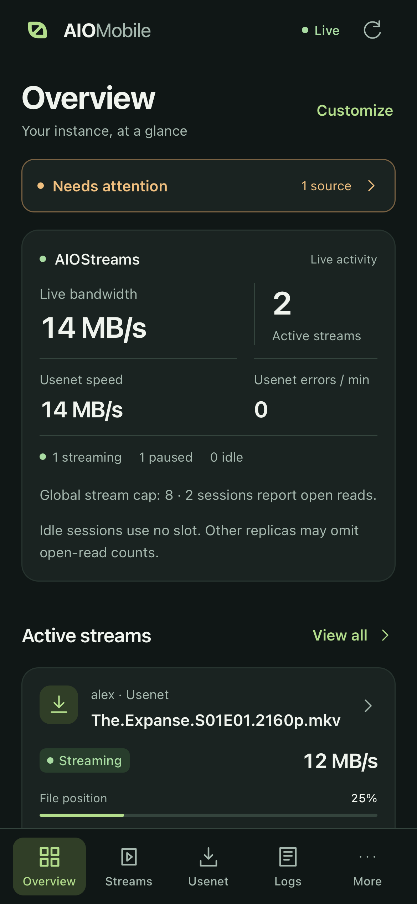
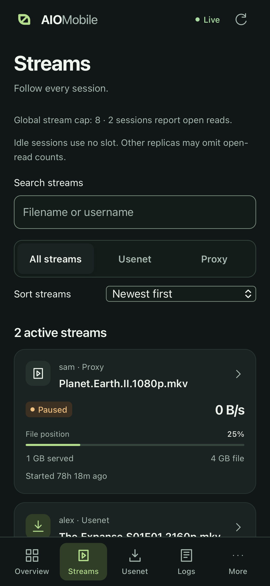
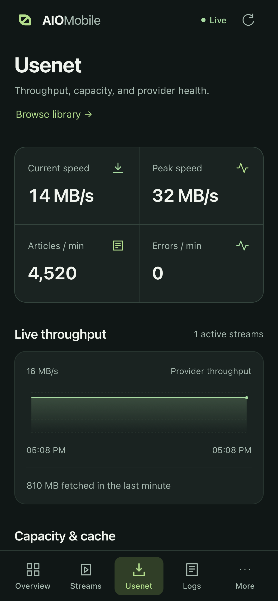
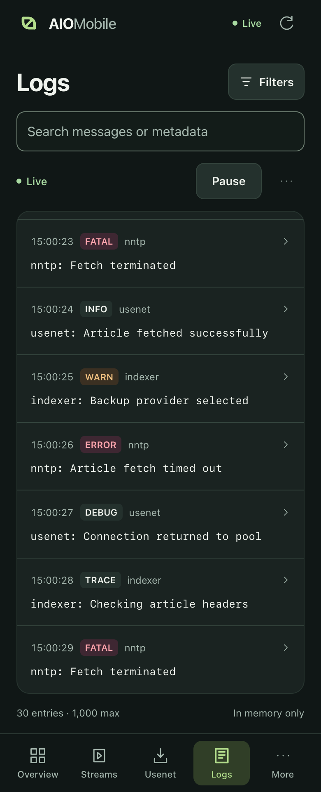
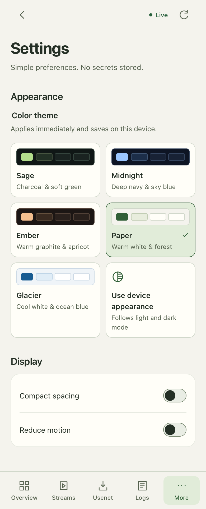
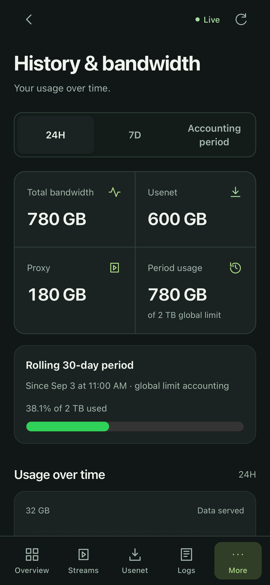

# AIOMobile

A mobile dashboard for your existing [AIOStreams](https://github.com/Viren070/AIOStreams) instance. Monitor streams, Usenet providers, bandwidth, indexers and logs from your phone, or install it as a Home Screen app.

AIOMobile is a static frontend. It uses AIOStreams' existing admin login and APIs, with no separate backend or credentials to configure.

## Screenshots

Screenshots use synthetic demo data. Overview, Streams, Usenet and History show the latest retained-usage dashboard additions. The header icon follows the selected theme.

| Overview · Sage | Streams · Sage | Usenet · Sage |
| :---: | :---: | :---: |
|  |  |  |

<details>
<summary>More screens and themes</summary>

| Logs · Sage | Settings · Paper | History · Sage |
| :---: | :---: | :---: |
|  |  |  |

</details>

## Install

Serve AIOMobile at **`https://YOUR-AIOSTREAMS-HOST/mobile/`** on the same hostname as AIOStreams. Leave the app's **AIOStreams base URL** setting blank.

You need:

- A working HTTPS AIOStreams instance with an admin account and the [required dashboard APIs](docs/api-contract.md).
- Node.js **22.18 or newer** and npm to build the app.
- Docker Compose and an existing Traefik setup for the steps below. For another reverse proxy, see the [deployment guide](deploy/INSTALL.md#other-reverse-proxies).

### Docker + Traefik

Run these commands on your Docker server. Alternatively, build on another machine and copy the prepared `deploy/` directory to the server before starting Compose.

```sh
git clone https://github.com/thetoadsage/aiomobile.git
cd aiomobile
npm ci
npm run build

mkdir -p deploy/site/mobile
cp -R dist/. deploy/site/mobile/
cp deploy/.env.example deploy/.env
```

Edit **`deploy/.env`** to match your existing AIOStreams and Traefik setup:

```dotenv
AIOSTREAMS_HOSTNAME=aio.example.com
AIO_DOCKER_NETWORK=aio_network
AIO_TLS_RESOLVER=letsencrypt
AIO_AUTH_MIDDLEWARE=authelia@docker
```

Use only the hostname for `AIOSTREAMS_HOSTNAME`, without `https://` or `/mobile/`. The other values must name your existing Docker network, TLS resolver and authentication middleware.

Start the standalone static service:

```sh
cd deploy
docker compose -p aiomobile config --quiet
docker compose -p aiomobile run --rm --no-deps aiomobile -t
docker compose -p aiomobile up -d --no-deps aiomobile
docker compose -p aiomobile ps
```

Open **`https://YOUR-AIOSTREAMS-HOST/mobile/`** and sign in with an AIOStreams admin account. If your proxy also uses Authelia, you may need to sign in there first.

The new service handles only `/mobile/`. AIOStreams continues serving its own dashboard, APIs and login. Keep this deployment separate from your existing Compose project. No host port is published.

## Use the app

| Screen | What it does |
| --- | --- |
| Overview | Current activity, System health and recent warnings; customize the section order. |
| Streams | Search, filter and inspect active streams, with file position, configured global stream cap and reported open reads. |
| Usenet | Live throughput, retained activity trends, provider time windows/history, download capacity and segment-cache statistics. |
| Logs | Follow server logs, search/filter, pause the view, copy or export entries. |
| More | History & Bandwidth, Indexers, Addon health, Background tasks, Usenet Library, Media Info and Settings. |

**Usenet Library** shows release availability, failures, files and recheck dates, with search and status filters. **Media Info** shows the current probe queue, recorded attempts and stored video/audio/subtitle tracks. These views are read-only; they do not initiate imports, rechecks or probes. Media Info requires an AIOStreams version with the newer dashboard routes and shows an unavailable message when they are missing.

**Background tasks** shows the latest results, errors and scheduled runs under More. Opening this screen does not run tasks.

**Streams** reports the latest read’s file position, including its starting offset. Buffering and seeking can make it differ from playback progress; it is unavailable between reads. The configured global stream cap and reported sessions with open reads are separate signals, and replica snapshots may omit reads.

**Usenet** separates app-open live throughput from retained transfer, article and error history. Provider details preserve the selected history window. Retention and missing buckets limit coverage.

**History & Bandwidth** adds per-user trends and expandable session details. Select **Accounting period** to compare user usage with bandwidth limits; 24h/7d totals cover different windows. The configured monthly reset date determines the monthly period.

**Addon health** shows retained preset requests, errors and average latency, with separate custom URL request counts. Choose 24h, 7d or All rollups. Collection and retention settings limit coverage; an empty window is not proof of healthy addons. Opening this screen does not call or test addons.

In **Settings**, choose Sage, Midnight, Ember, Paper or Glacier, or follow device appearance. Adjust compact spacing, reduced motion and refresh preferences. The header icon follows your selected theme. Keep the base URL blank when using the recommended installation.

Use the top-right refresh button or pull down from the top of a page to refresh. Live data updates automatically while the app is open. The throughput chart needs a few samples before it can draw a line.

Stopping a stream interrupts that playback. Clearing logs removes the **entire server's retained log buffer**, even when filters are active. Both actions ask for confirmation.

### Add to your iPhone Home Screen

1. Open the `/mobile/` URL in Safari.
2. Tap **Share → Add to Home Screen**.
3. Enable **Open as Web App** if shown, then tap **Add**.
4. Launch AIOMobile from the Home Screen. Sign in again if the installed app has a separate session.

The installed icon uses the Flow design in Sage. If an icon update still shows the old image, remove and re-add the Home Screen shortcut.

## Updates and troubleshooting

Back up the deployed files before updating. Keep older fingerprinted JS/CSS assets available, and copy the new `index.html` and `sw.js` last. Static updates do not require restarting AIOStreams. Follow the [update and rollback guide](deploy/INSTALL.md#updating-an-existing-deployment).

When the app offers **Update**, tap it to load the new version.

- **Cannot connect:** check that AIOStreams is reachable and the app is served on the same hostname. Keep the base URL blank.
- **Login or permission error:** sign in with an AIOStreams **admin** account, including inside the installed app if needed.
- **No data while offline:** expected. Only the app shell is cached; monitoring data and logs are not stored for offline use.
- **Feeds stop in the background:** expected. They reconnect when you return to the app.

The app stores only connection/display preferences. It does not store passwords, API keys or session tokens, and does not automatically run provider tests, indexer grabs or instance configuration changes.

## Development

```sh
npm ci
npm run dev
```

Open `http://localhost:5173/mobile/`. To proxy an instance's API and login during development:

```sh
AIO_DEV_TARGET=https://aio.example.com npm run dev
```

Production login cookies are not shared with localhost, and secure cookies may require HTTPS. For a straightforward authentication test, use the same-origin deployment above.

Checks and build:

```sh
npm run lint
npm test
npm run build
npx playwright install chromium webkit
npm run test:e2e
```

The build writes `dist/`. Browser tests use synthetic local fixtures. See the [API contract](docs/api-contract.md), [validation notes](docs/validation.md) and [release packaging instructions](deploy/INSTALL.md#building-release-archives).

Licensed under [AGPL-3.0](LICENSE); see [NOTICE](NOTICE) for attribution.
