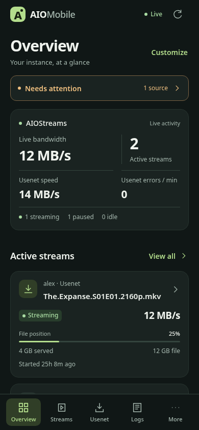
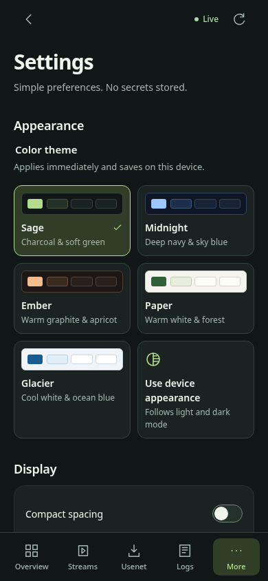
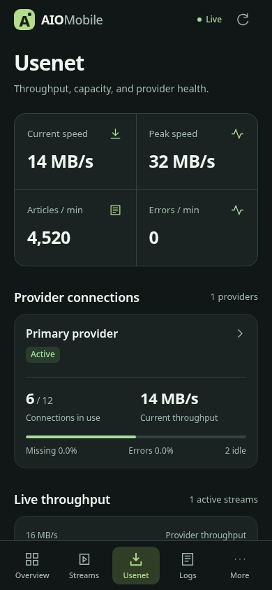
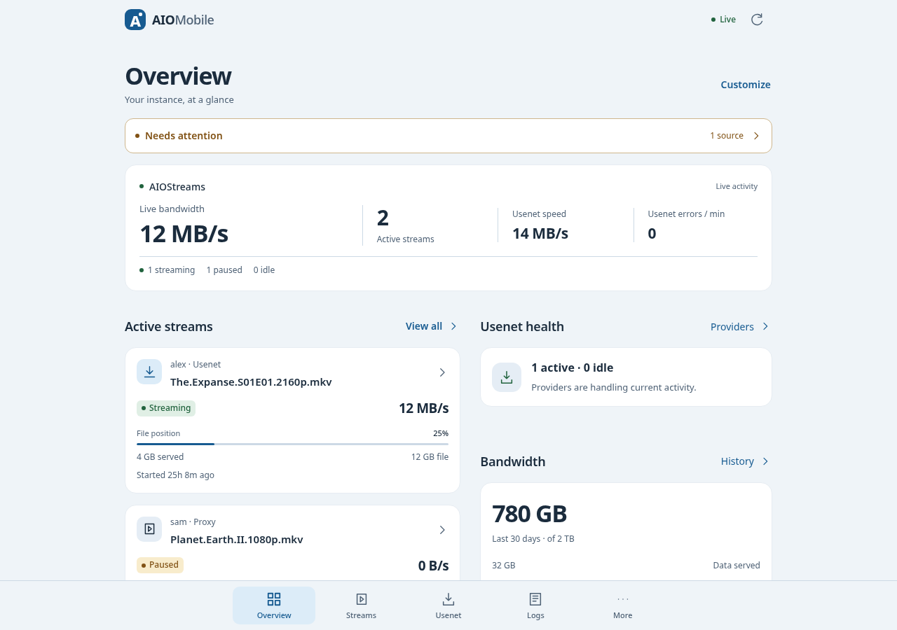

# Mobile monitoring UI

The layout groups related monitoring data for scanning and operating the app on a phone, with a two-column overview on wider screens.

- Overview shows live bandwidth, active streams, Usenet speed, errors and the streaming/paused/idle breakdown.
- Stream cards separate identity, activity, throughput and file position. Bytes served and file size remain explicitly labeled; neither is the file position.
- Provider connections precede the throughput chart. Provider and indexer metrics use simple dividers and readable columns.
- Shared typography, spacing, quiet surfaces and status colors apply across all screens. Navigation and controls retain keyboard focus, touch targets, safe-area handling and reduced-motion support.
- Five [themes](themes.md), stream search/sorting, attention links and [overview customization](monitoring-tools.md) are available without changing existing API fields or confirmation flows.

## Screenshots

These captures use synthetic test fixtures, not production monitoring data.

| Overview | Settings | Usenet |
| --- | --- | --- |
|  |  |  |

## Validation

The UI build passed production build/typecheck, lint, 26 unit tests and all 51 Chromium browser tests. Coverage includes ten routes at phone, landscape, tablet and desktop widths from 320px to 1280px; all five themes; contrast; keyboard controls; persistence; settings validation; search/filter/sort; overview ordering; authentication; live updates; confirmation actions; and service-worker behavior.

WebKit could not launch because required system libraries are missing. Safari and physical-device behavior remain unverified.
